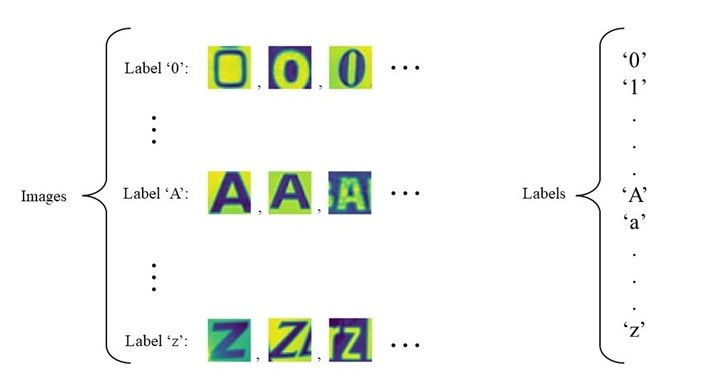
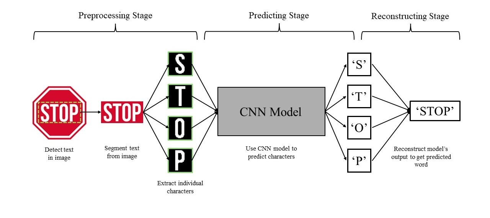
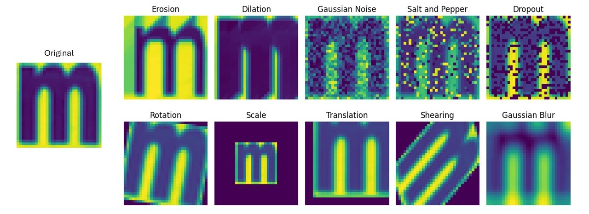
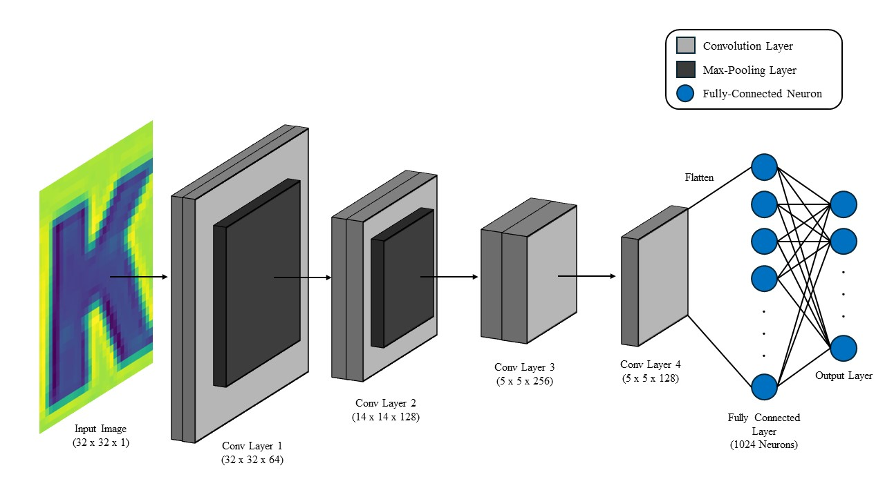
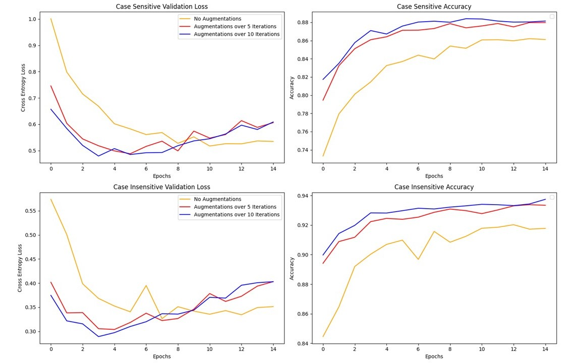

# More Information on Project

This file goes over the data format and preprocessing, model's architecture, and model's benchmark results in more detail. The methods used to build the CustomOCR were inspired by different papers and projects. Please refer to the references section in the README file for more information. 

# Data Format
For this project, I used the images (both case-sensitive and case-insensitive) in Jaderberg, Vedaldi, and Zisserman's "Deep Features for Text Spotting" paper published in the European Conference on Computer Vision (ECCV) 2014. These images were stored as `.mat` files and had a similar structure to the diagram shown below. 

  

  <em>
    This is a visual depiction of the case-sensitive data format.
  </em>

The labels section contained all the unique characters used in that dataset. The case-sensitive would have 62 labels (0-9, A - Z, a - z) and the case-insensitive would have 36 labels (0 - 9, A - Z). The images section would contain character images for each corresponding label. For example, the first index would contain all the images representing '0' and the tenth index would contain all the images representing 'A'. 

The original dataset was saved using the HDF5 format and could only be accessed using the `mat73` package. In order to make the loading and saving process faster, I downgraded the mat file to an older version using `scipy`. Hence, when viewing the files in the `datasets` folder, you may recognize some discrepancies between the original file and my edited version of the file.

# Project Outline
The OCR system created in this project has three stages: the preprocessing stage, the model prediction stage, and the reconstruction stage.
 - **Preprocessing:** In this step, the texts identified in a given image are isolated and individual characters are segmented from each detected word. These letters are then resized and padded accordingly for the model. 
 - **Model Prediction:** The CNN model takes in the segmented characters from stage one as inputs. The model will then output its prediction for each character given. 
 - **Word Reconstruction:** The individual predicted characters are then grouped to create a machine-readable text representing the detected word from the image.

Below shows a general outline of the CustomOCR system.

  

  <em>
    A simple depiction of the outline for the CustomOCR system.
  </em>

## Preprocessing Stage
This section will go in detail how individual components in the preprocessing stage work. This includes word detection and character segmentation. For more information regarding code, please view the `preprocess_demo` notebook in the `demos` folder.

### Using CRAFT Algorithm to Detect Words in Images
In order to identify and segment text in images, I used the Character Region Awareness for Text Detection (CRAFT) algorithm. The CRAFT algorithm was devloped at NAVER Corporation for segmenting words in images. The algorithm uses the VGG-16 layout to identify the region and affinity score for characters in an image. The region scores indicates the locations that are most likely to contain characters while the affinity scores predicts the connectivity of the potential characters. By combining the two techniques, the CRAFT algorithm is able to create a bounding box around the words presented in a given image. For this project, I used the craft-text-detector python package developed by fcakyon. 

The bounding boxes outputted by the CRAFT algorithm were then isolated for character segmentation.

### Character Threshold Segmentation
Given the segmented text using the CRAFT algorithm, I applied Otsu's Global Thresholding technique to extracted individual characters from the word image. Otsu's Threshold allowed me to clearly distinguish the foreground (the word) and the background by assigning the foreground with white pixels and the background with black pixels. I was then able to obtain the bounding box of each character using `opencv` (please look at `preprocess_demo` for more details). The acquired bounding boxes containing each character was resized and padded to 32x32 pixels. This way, each character image was compatible with the CNN model.

## Model Prediction Stage
This section will go in detail over the model's architecture, the training process, and the performance evaluation. For more information regarding the technical coding aspect, please refer to the `augmentation_demo` and the `model_training_demo` notebooks in the `demos` folder.

### Data Augmentation
In order to create a more diverse dataset and to artificially enlarge the training dataset without additional labeled images, I used several morphological augmentations using the `imgaug` package. These included:
 - Erosion
 - Dilation
 - Gaussian Noise
 - Salt and Pepper Noise
 - Dropout
 - Rotation
 - Scale
 - Translation
 - Shearing
 - Gaussian Blur
 
By applying these operations, the model will be able to learn image features in various scenarios, ignore background noise, and focus on fundamental properties of each letters.

  

  <em>
    Visual representation of the augmentations applied in this project.
  </em>

Using these augmentations, I would iterate the my original training dataset over $n$ iterations. This would mean, given a list of images, the augmentations would randomly be applied to each image $n$ times. Following this step, any duplicate images were removed. Therefore, by applying augmentations for one interval would increase my training dataset by approximately 90%. 

For this project, I used a training dataset with no augmentations, with augmentation over 5 iterations, and with augmentations over 10 interations. These datasets were used to benchmark the model to see which resulted in the best accuracy. 

### Model Architecture
The CNN model that I used for character recognition was heavily influenced by the LeNet5 model by LeCun's "Gradient-Based Learning Applied to Document Recognition". While the LeNet5 model is very accurate when predicting the MNIST's hand-written dights, it's design was too simple and couldn't directly be transferred to this project. Hence, I made some modifications to the layers to learn more diverse features in the character datasets. The architecture for my custom CNN model is shown below.

  

  <em>
    The custom CNN model architecture used for character recognition.
  </em>

I made four convolutional layers for the CNN model. The kernel size was 5x5 for the first convolutional layer, and 3x3 for the next two layers. Padding was applied only to the first layer. The final convolutional layer had a kernel size of 1x1. This allowed the model to learn more advanced and complex patterns by combining channels from the previous layer. Furthermore, having a kernel size of 1x1 allows the model to make more abstract predictions while maintaining spatial dimensions. The outputs of the 1x1 convolutional layer was then flattened and connected to a dense layer with 1024 neurons. Dropout of 50% was added to avoid potential overfitting. The dense layer was then connected to the classifier layer which had either 62 neurons (case-sensitive) or 36 neurons (case-insensitive).

A stride of 1x1 was used for all convolutional layers and 2x2 for all max-pooling layers. The kernel size for max-pooling layers was 2x2. I purposefully omitted a max-pooling layer on the third convolutional layer since the dimensions were 5x5x256. 

The LeakyReLU activation function was used for all layers to avoid the vanishing gradient problem as well as the dying ReLU problem. Batch normalization was also applied to all the convolutional layers to adjust any shifts in weight. 

### Training and Evaluation
For the training process, I first splitted the original images into training, validating, and testing datasets. The testing dataset made up of 20% of the original images. For the remaining 80% of the images, 20% were designated as the validation datasets while the remaining images were used for training. Therefore, the overall split was: 64% training, 16% validating, and 20% testing.

I then applied augmentations to the training images. This allowed me to work with three different training datasets: original training images (68728 sensitive, 118782 insensitive), augmentations over 5 iterations (334959 sensitive, 583536 insensitive), and augmentations over 10 iterations (602340 sensitive, 1048991 insensitive).

For the model parameters, I used the categorical cross entropy loss function and the Adam optimizer with an initial learning rate of $1e-4$. The validation loss and accuracy were tracked for 15 epochs on all three training datasets to see if there were any improvements in performance using an augmented dataset. The model weights with the loweset validation loss were saved. Below shows the metrics for the training process of the case-sensitive and case-insensitive characters.

  

  <em>
    The validation loss and accuracy for all three training datasets.
  </em>

We can see that the validation loss values for the augmented datasets start lower but begins to increase after 5 - 8 epochs. However, the validation accuracies are much higher when compared to the model trained with the original dataset. A good reason why the validation loss increases after a certain amount of epochs is that the model starts to memorize the training images. To avoid this problem, we might have to add more diverse augmentations to our training images. 

The saved model's training time as well as its loss and accuracy on the testing images are shown below. 

  <table style="margin: 0 auto; border-collapse: collapse;">
    <thead>
      <tr>
        <th></th>
        <th>Test Loss</th>
        <th>Test Accuracy</th>
        <th>Processing Time (min:sec)</th>
      </tr>
    </thead>
    <thead>
      <tr>
        <th colspan="4" style="text-align: center;">Case Sensitive</th>
      </tr>
    </thead>
    <tbody>
      <tr>
        <td>No Augmentations</td>
        <td style="text-align: center;">0.5721</td>
        <td style="text-align: center;">85.63%</td>
        <td style="text-align: center;">1:38</td>
      </tr>
      <tr>
        <td>Augmentations over 5 Iterations</td>
        <td style="text-align: center;">0.6273</td>
        <td style="text-align: center;">87.50%</td>
        <td style="text-align: center;">4:05</td>
      </tr>
      <tr>
        <td>Augmentations over 10 Iterations</td>
        <td style="text-align: center;">0.6372</td>
        <td style="text-align: center;">87.80%</td>
        <td style="text-align: center;">5:19</td>
      </tr>
    </tbody>
    <thead>
      <tr>
        <th colspan="4" style="text-align: center;">Case Insensitive</th>
      </tr>
    </thead>
    <tbody>
      <tr>
        <td>No Augmentations</td>
        <td style="text-align: center;">0.3585</td>
        <td style="text-align: center;">91.79%</td>
        <td style="text-align: center;">2:48</td>
      </tr>
      <tr>
        <td>Augmentations over 5 Iterations</td>
        <td style="text-align: center;">0.4077</td>
        <td style="text-align: center;">93.33%</td>
        <td style="text-align: center;">7:27</td>
      </tr>
      <tr>
        <td>Augmentations over 10 Iterations</td>
        <td style="text-align: center;">0.4062</td>
        <td style="text-align: center;">93.48%</td>
        <td style="text-align: center;">9:06</td>
      </tr>
    </tbody>
  </table>

  <em>
    A table documenting the model's loss and accuracy on the testing images. Also shows each of the model's training time in minutes and seconds. (NOTE: This was done on my personal computer. These statistics can be different when running on your computer.) 
  </em>

The results shown in the testing dataset corresponds to the statistical results of the validation dataset. The loss values for the testing images increase as the more augmentations are applied. However, the accuracy also increases as the number of images in the training dataset increases. Once again, one can add more diverse augmentations or add more labeled images to make sure the loss values don't saturate too quickly.

## Word Reconstruction
After segmenting individual characters in the preprocessing stage, the characters were sorted based on their horizontal or vertical displacement. That way, the leftmost letter would be the first character and the rightmost letter would be the last character in a given word. These images were then inputted into the character recognition model and the outputs were appended to a string. This process would be repeated for all the potential words detected by the CRAFT algorithm and stored in a list. 

# Conclusion
For the character recognition CNN model, it has a fairly high accuracy rate with 87.80% for case-sensitive letters and 93.48% for case-insensitive letters. While adding more diverse augmentations or additional labeled images can help improve the loss and accuracy of the model, I believe the performance presented in this project is approximately the saturation point. This is because by identifying characters alone, a CNN model will have trouble distinguishing similarly shaped objects. For example, in case-sensitive characters, "Z" and "z" are essentially identical while in case-insensitive letters, characters like "0" and "O" are very similar in shape. To address this issue, one can use Convolutional Recurrent Neural Networks (CRNN) so that the model can learn spatial features and remember sequential information. Pairing this with bigrams (images containing two characters) or full words, the model can predict whether the letter is upper-case or lower-case by looking at character placements. OCR models, such as EasyOCR and Keras OCR, employs this design to get a much higher accuracy rate.  
