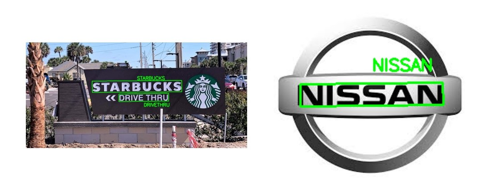

# Optical Character Recognition Project

## Summary
In this project, I tried to replicate popular Optical Character Recognition (OCR) packages (EasyOCR and Keras OCR) using Convolutional Neural Networks (CNN). The custom made model has an 87.80% accuracy with predicting case sensitive characters and a 93.48% accuracy for case insensitive characters. This project showcases the following:
 - Identifying and segmenting characters in images
 - Augmentations of datasets for enhancing model performance
 - Creating and benchmarking custom made CNN model using Tensorflow
 - Reconstructing words from model outputs

  

  <em>
    These are some of the results by the custom made OCR in this project.
  </em>

## Requirements
This project was created in `Python=3.10`. The additional requirements needed to compile this code correctly are listed in the `requirements.txt` file located in the root folder.

## USEME Location
The `USEME.md` provides instructions on how to set up the Python environment, run the scripts provided in this project, and use the custom made OCR model. The `USEME.md` file is located in the root folder.

## MORE_INFO Location
The `MORE_INFO.md` file offers detailed explanation into data preprocessing and augmentation, model architecture, training performance, and evaluating results. The `MORE_INFO.md` is located in the root folder.

## Dataset Availability:
For this project, I used the datasets provided in Jaderberg, Vedaldi, and Zisserman's "Deep Features for Text Spotting" paper published in the European Conference on Computer Vision (ECCV) 2014. I used their images for case-sensitive and case-insensitive characters. The acquired dataset was split into training, validating, and testing datasets. Additional training datasets were created by augmenting the original training dataset. I couldn't upload these files to Github due to their size, but you can download them [here](https://drive.google.com/drive/folders/1R9Kfkp2E39SamfRr7D0zXWMf4QwYKzhu?usp=drive_link).

## Example Images
The images stored in the `example_images` directory are used in the `MORE_INFO.md` file.

## Code Design
The main components for this project are the `CustomOCR` folder, the `datasets` folder, the `saved_models` folder, the `scripts` folder, and the `demos` folder.

The `CustomOCR` folder contains the source code for this project. It has the following modules:
 - `utils`: Stores code for utility functions and helper modules for this project.
    - `file_operations`: Module containing all the code related to file operations (saving, loading, etc).
    - `image_operations`: Module containing all the code related to image operations (removing duplicate images, sorting images, etc).
 - `preprocess`: Module containing code for preprocessing images. Identifying words and extracting characters for model training.
 - `augmentations`: Module containing code for augmenting images. Allows users to apply image augmentations to a given dataset over $n$ iterations.
 - `ocr_model`: Module containing the CNN model for character recognition. Able to initialize model as well as load in pre-trained weights. 
 - `train_eval`: Module containing the training and evaluating process. Allows users to train a model on case-sensitive or case-insensitive mode. 
 - `custom_ocr`: A module that stores pre-trained CNN models and allows users to apply the model to given images.

The `datasets` folder stores all the datasets and images for this project.
 - `case_insensitive`: The folder storing all the training, validating, and testing datasets for case-insensitive characters.
    - `case-insensitive-train.mat`: The original `.mat` file for case-insensitive characters from the ECCV 2014 conference.
    - `resized-insensitive-train.mat`: The original `.mat` file for case-insensitive characters with images resized to 32x32 pixels.
    - `train_aug_0.mat`: The training dataset for case-insensitive characters with no augmentations.
    - `train_aug_5.mat`: The training dataset for case-insensitive characters with augmentations over 5 iterations.
    - `train_aug_10.mat`: The training dataset for case-insensitive characters with augmentations over 10 iterations.
    - `val.mat`: The validation dataset for case-insensitive characters.
    - `test.mat`: The testing dataset for case-insensitive characters.

 - `case_sensitive`: The folder storing all the training, validating, and testing datasets for case-sensitive characters.
    - `case-sensitive-train.mat`: The original `.mat` file for case-sensitive characters from the ECCV 2014 conference.
    - `resized-sensitive-train.mat`: The original `.mat` file for case-sensitive characters with iamges resized to 32x32 pixels.
    - `train_aug_0.mat`: The training dataset for case-sensitive characters with no augmentations.
    - `train_aug_5.mat`: The training dataset for case-sensitive characters with augmentations over 5 iterations.
    - `train_aug_10.mat`: The training dataset for case-sensitive characters with augmentations over 10 iterations.
    - `val.mat`: The validation dataset for case-sensitive characters.
    - `test.mat`: The testing dataset for case-sensitive characters.

 - `images`: The folder storing all the images that were used to test the CustomOCR model. Users can load these images into a Python notebook and extract the text within them. 

The `scripts` folder stores the all the scripts for this project (see `USEME.md` for more information).
 - `augment_dataset`: The script for augmenting user's datasets.
 - `train_model`: The script for training the custom OCR model.

The `demos` folder stores all the notebooks documenting each step of the project.
 - `preprocess_demo`: The notebook documenting the process of identifying words in images and extracting their individual characters for model training.
 - `augmentations_demo`: The notebook documenting the augmentation process for trianing images.
 - `model_training_demo`: The notebook documenting the process of loading training datasets, training the custom OCR model, and evaluating the model's performance on the testing dataset.

## References
TBA
